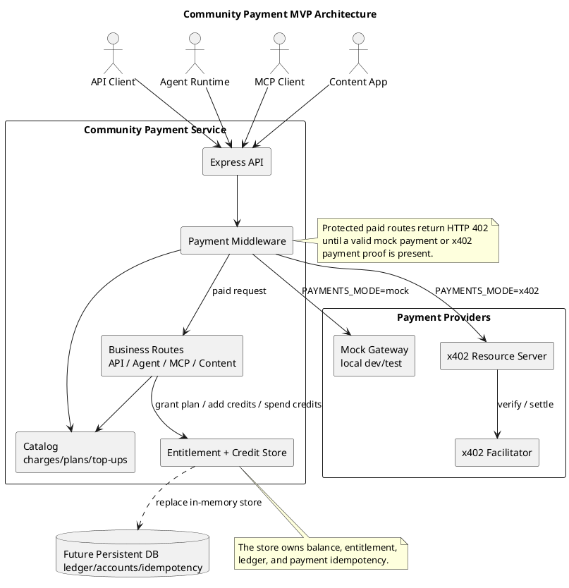

# Community Payment

An x402-compatible payment middleware for community apps that sell API calls, agent tasks, MCP tools, gated content, plans, and small credit top-ups.

## What This MVP Covers

- Pay-per-use endpoints for API, Agent, MCP-style tool calls, and content.
- Plan purchase and entitlement checks.
- Credit top-up and internal credit consumption.
- Idempotent purchase application keyed by payment proof.
- Local mock payment mode for development and tests.
- Real x402 middleware path using `@x402/express` v2.

## Architecture

Source diagram: [`docs/architecture.puml`](docs/architecture.puml)



## Run Locally

```bash
npm install
cp .env.example .env
npm run dev
```

The default `PAYMENTS_MODE=mock` returns `402 Payment Required` unless the request includes:

```http
X-Mock-Payment: paid
```

Try the catalog:

```bash
curl http://localhost:3000/v1/catalog
```

Try a paid API call in mock mode:

```bash
curl -i http://localhost:3000/v1/api/weather
curl -i -H 'X-Mock-Payment: paid' http://localhost:3000/v1/api/weather
```

## Real x402 Mode

Set:

```dotenv
PAYMENTS_MODE=x402
X402_PAY_TO=0xYourWalletAddress
X402_NETWORK=eip155:84532
X402_FACILITATOR_URL=https://facilitator.x402.org
```

Then restart the server. Protected routes will use x402 `exact` payment requirements.

## Main Endpoints

- `GET /health`
- `GET /v1/catalog`
- `GET /v1/api/weather` - pay per API call
- `POST /v1/agents/summarize` - pay per agent task
- `POST /v1/mcp/tools/quote.call` - pay per MCP-style tool call
- `GET /v1/content/research-note` - pay per content item
- `POST /v1/plans/pro/purchase` - buy a 30-day plan
- `GET /v1/plans/pro/report` - requires active plan entitlement
- `POST /v1/topups/starter/purchase` - buy internal credits
- `POST /v1/credits/agent-call` - spend internal credits
- `GET /v1/me` - inspect current account state

Use `X-Community-User` to select an account. If omitted, the server uses `anonymous`.

## Verify

```bash
npm run typecheck
npm test
```
